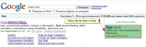

Não é mentira! Acredite se quiser. E caso não acredite em mim! Faça o teste pelo Google.

Após digitar "Banco Real" na busca do Google, encontrei um plagio do Internet Banking do Banco Real que aparece em Links Patrocinados. Eles devem ter aproveitado que o Banco Real não o fez, não tinha feito(O Banco Real utiliza os Links Patrocinados desde a divulgação deste post), e então aparecem apareciam sempre em primeiro. Como devem saber, randomicamente o Google exibe o Link Patrocinado embaixo do campo de busca. Para usuários comuns, interpretam como sendo o primeiro resultado. Ou seja, acreditam fielmente que é o Site Oficial.

Estou chocado com o GOLPE que percebi de imediato!

Acredito que 98% dos leitores seriam capazes de identificar este Golpe. Mas por gentileza, avisem aos seus colegas que são usuários comuns. Até mesmo, algum usuário com pressa e desatento poderia cair numa armadilha dessas.

É impressionante a qualidade do Golpe.

Um usuário comum ou até um desatento não perceberia em momento algum que passa de um site corrupto.
Os marginais desenvolveram um site que possui o Layout idêntico ao Site Oficial e utilizam os Links patrocinados do Google para aparecerem até mesmo antes do Site Oficial.

A home é idêntica ao site oficial. Como fiquei impressionado, segui por todos os campos para analisar o Golpe.

Após digitar os dados na Home, temos um teclado virtual idêntico ao site oficial do Banco Real. Testei utilizar o teclado, e não funcionou. O desenvolvedor sabia mesmo o que estava fazendo.

A partir daí, eles já sabem a sua senha. E podem visualizar toda a sua conta. Mas com apenas estes dados, os marginais não podem. Portanto, eles redirecionam para uma janela(que não existe no Site Oficial) e solicitam o seu CPF e sua senha. Percebam que a senha solicitada é a do Disque Real.

Após digitar os dados, eles exibem uma janela de erro. O impressionante, é que a semelhança dessa janela de erro com alguns alertas do site oficial são imperceptíveis até mesmo para quem utiliza esse serviço diariamente.

Com o seu CPF eles podem, pelo próprio Google, descobrir todos os seus dados e aplicarem vários Golpes. Principalmente pelo Disque Real, que é extremamente seguro, porém se você não divulgar a sua senha. Em algumas movimentações, o atendente solicita alguns dados pessoais para comprovação. Dados que os marginais podem descobrir facilmente pelo Google.

Percebam que em momento algum, o site possui a chave de segurança, conseguindo com o https!

Por favor, divulguem isso para todos que vocês conheçam!

Obviamente, não é um email mentiroso! Eu mesmo fiz esses screenshots e essas marcações! Caso não acredite, teste você mesmo!

Obs: Não vá digitar os seus dados corretamente e depois me xingar, né? rsrs

> Uma dica para você dificultar cair num golpe desses. Sempre que for acessar sua conta do banco, preencha a senha pela primeira vez incorretamente. Se for realmente seu banco, irá informar um erro de usuário. Aí você pode confiar um pouco mais para digitar novamente. Só não vai errar 3 vezes e bloquear a senha, né?
