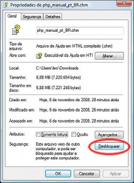
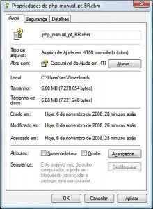
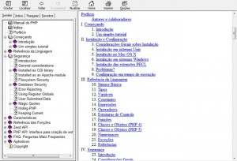
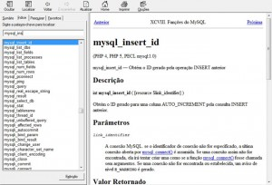
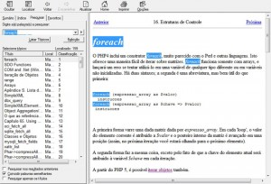
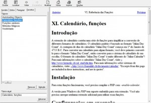

Estava desenvolvendo uma classe aqui na minha máquina local e esqueci o nome de uma função. Eu entraria no [site do php](http://www.php.net/manual/pt_BR/index.php "Manual do PHP OnLine") ou procuraria no [pai dos burros](http://google.com.br "Buscador Google"), mas estava sem internet(percebi o quanto sou dependente de um [site de buscas](http://google.com.br "Buscador Google") e da web).

Aí eu te pergunto se você(assim como eu) se encaixa em algum dessas opções

*   Você não conhece todas as funções do PHP
*   Você não lembra todos os nomes das funções ou as confude(afinal, errar é humano)
*   Você conhece uma função, mas não sabe se existe alguma semelhante ou que sirva melhor para seu algoritmo
*   Você deixa a página do php como inicial do seu navegador

É, acredito que se algum dia você desenvolveu, ou se ainda programa em PHP, se encaixa em um dos perfis acima.

Não dependa mais da web e faça o [download do arquivo de ajuda do manual do PHP](http://www.php.net/distributions/manual/php_manual_pt_BR.chm "Link para o download do arquivo de ajuda do PHP em Português do Brasil (PT-BR)") em Português do Brasil.

Caso você queira o arquivo em outro idioma clique no link abaixo:
[http://www.php.net/distributions/manual/php\_manual\_pt\_BR.chm](http://www.php.net/distributions/manual/php_manual_pt_BR.chm "Link para a lista de arquivos de ajuda do PHP em todos os idiomas")

> **Atenção: Caso o seu arquivo não abrir ou exibir algo como "A página não pode ser exibida", então clique com o botão direito do mouse e clique em Desbloquear.**

_Desbloqueando o Arquivo de Ajuda_

Arquivo de Ajuda do PHP desbloqueado

**Obs: algumas funções ou referências ainda não foram 100% traduzidas.**

Abaixo deixo algumas dicas de como utilizar este manual como arquivo ajuda.

Temos o Sumario que é praticamente a copia do site na web.

Sumário da Ajuda do PHP

Navegando pelo Conteúdo da Ajuda do PHP

Quando abrimos a ABA Índice, podemos utilizar como um auto-completar de todas as funções do PHP. É ótimo para lembrarmos o "resto" do nome daquela função.

Auto-Completar na Aba Índice pela Ajuda do PHP

Algo que não poderia faltar é um sistema de Busca. Serve para quando não conseguir encontrar nada pelo Auto-completar. Este eu recomendo até utilizar antes do Google.

Resultados da pesquisa feita na Ajuda do PHP

E para finalizar, guarde as "páginas" mais utilizadas nos Favoritos. É bem no estilo Web2.0. Caso você queira guardar a página que está sendo visualizada. abra a aba Favoritos e clique lá embaixo à esquerda em Adicionar. Antes de adicionar você pode até alterar o nome que será exibido na sua lista. O mesmo poderá ser alterado ou excluído mais tarde.

Favoritos ou Bookmarks da Ajuda do PHP

> Saiba que o conteúdo é excelente para novatos(pois tem desde a história do PHP) até aos mais avançados(possui toda a documentação da linguagem). 
> Acreditem, descobri até que possui uma função chamada `dotnet_load();`, provavelmente o PHP roda até script em .NET.
