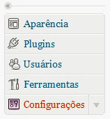
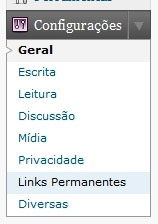
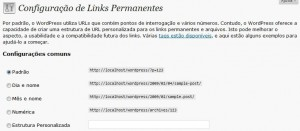
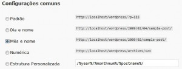
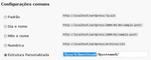
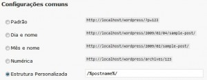
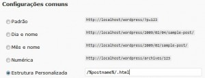
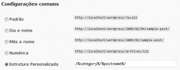
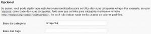

Acompanho muitos feeds de Blogs e a maioria deles é em WordPress.<br>
Percebo que alguns blogueiros, por não conhecerem a simplicidade de utilizarem esta função no WordPress, não utilizam URL Amigáveis.

Para quem ainda não conhece, **URL Amigáveis** são aquelas URLs fáceis de serem decoradas. Onde deixamos de utilizar aquelas variáveis via GET que deixam a URL confusa e poluída. Ainda por cima dificulta a indexação do Google.

Se você precisa de um motivo para alterar os Links Permanentes do seu WordPress, saiba que seus leitores poderão facilmente decorar as URLs de seus posts ou de suas categorias e até mesmo dos seus ficheiros de arquivos antigos.<br>
Além de possuir influência em SEO, uma vez que o Google e os demais buscadores pode indexar as URLs em maior relevância separadas por diretórios(URL amigáveis) ao invés de parâmetros enviados via GET.

Agora vou ensinar como trocar sua URL de:<br>
`http://www.meusite.com.br/?p=123`<br>
para<br>
`http://www.meusite.com.br/nome-do-meu-post`

No Tutorial, estou utilizando a **versão 2.7 do WordPress**, mas seguindo minhas orientações você conseguirá alterar em **qualquer versão do WordPress**.

> Antes de mais nada, você precisa habilitar o MOD REWRITE do APACHE. Mas a maioria dos servidores de hospedagem já habilitam essa opção por padrão. Aconselho a utilização de servidores LINUX para o seu WordPress com Apache2.

Após estar Logado em seu wp-admin, clique em Configurações(em algumas traduções você irá clicar em Opções).




Links Permanentes no Menu Configurações do WordPress

Perceba que o padrão é a opção: `http://www.meusite.com.br/?p=123`:<br>
[](./permalinks-wp-configuracoes.jpg "Links Permanentes - Padrão ?p=123")

Você pode escolher a opção **Mês e nome** ou **Dia e nome**, ideais para blogs de notícias, em que a data é importante. E útil deixá-la na própria URL. Assim, o usuário poderá identificar se o post é antigo ou atual.
[](./permalink-mes-nome-wordpress.jpg "Permalink Mês e Nome pelo WordPress")

Perceba, que ao selecionar as opções você pode alterar a Estrutura Personalizada.
[](./permalinks-excluir-ano-mes.jpg "Permalinks Personalizados no WordPress")

A **minha recomendação é deixar apenas _/%postname%/_**
[](./permalink-ideal-wordpress.jpg "Permalink recomendado para o WordPress")

Antigamente, quando utilizava o domínio _.com_, deixei os permalinks com _.html_. Mas com o tempo percebi que atrapalha a leitura e também dificulta a memorização.<br>
Não pense que a indexação do Google para SEO é melhor com _.html_ que não é verdade.<br>
[](./permalink-html-wordpress.jpg "Permalinks com .html no WordPress")

Você também pode incluir o nome da **categoria na URL do post**. Muito útil para blogs que possuem muitos assuntos. Imagine que você tenha uma seção de esportes e outra de música.<br>
E queira fazer um post sobre o Roberto Carlos(cantor ou jogador?)<br>
Não seria interessante as URLs:<br>
`http://www.meusite.com.br/esportes/roberto-carlos/`<br>
e<br>
`http://www.meusite.com.br/musica/roberto-carlos/`<br>
Para isso, basta inserir, a variável **%category%** antes da barra do seu **/%postname%/**, conforme o meu exemplo:
[](./permalink-categoria-nome-post-wp.jpg "Permalinks com a Categoria e Nome do Post no WordPress")

Se quiser customizar sua URL com o nome do autor do post, utilize **%author%**

Mais customizações pela Documentação do WordPress sobre [Using Permalinks](http://codex.wordpress.org/Using_Permalinks "Usando Permalinks do WordPress")

<span style="color: #800000;">Muitos blogueiros alteram o nome de suas URLs e acabam se esquecendo de “traduzir” **o category**(valor padrão para categorias) **para categoria**. O local para esta tarefa é em **Base da categoria**.<br>
[](./permalink-categorias-wordpress.jpg "Permalink da Base de Categorias no WordPress")</span>

Em alguns servidores, será necessário incluirmos um arquivo **.htaccess**.<br>
O próprio WordPress costuma nos informar e ainda disponibiliza uma caixa de texto com conteúdo deste arquivo.

Deixarei abaixo o **conteúdo do arquivo .htaccess do WordPress**:
```
<IfModule mod_rewrite.c>
RewriteEngine On
RewriteBase /
RewriteCond %{REQUEST_FILENAME} !-f
RewriteCond %{REQUEST_FILENAME} !-d
RewriteRule . /index.php [L]
</IfModule>
```

Caso tenha alguma dúvida, poste nos comentários.

> Aproveito para pedir desculpas sobre minha ausência. Estou envolvido em 3 projetos grandes e como sempre o prazo é curto. Saibam que nem estou lendo meus feeds.<br>
> Mas em breve, postarei mais informações sobre WordPress e o Zend Framework. O qual tenho me [dedicado muito tempo](http://leocaseiro.com.br/programador-web-estuda-mais-q-medico/ "Programador Web precisa estudar mais do que Médico").<br>
><br>
> Também deixarei dicas e tutoriais de tudo que aprendi no [Curso SEO](http://www.marketingdebusca.com.br/curso-seo/ "Curso SEO") do professor Paulo do [Marketing de Busca](http://www.marketingdebusca.com.br/ "Marketing de Busca"), e também autor do livro [Livro SEO Otimização de Sites](http://livroseo.com "Link permanente Livro SEO Otimização de Sites")(li e recomendo) e em breve deixarei informações e algumas dicas para otimização de sites.
