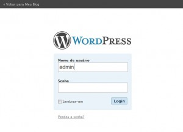
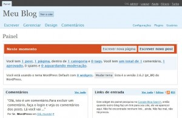
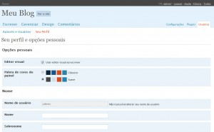
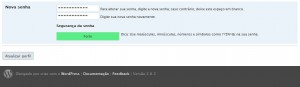

Para **alterar a senha do Wordpress**, primeiramente precisamos logar. Lembre-se que o seu painel administrativo possui a URL de seu blog seguida de **/wp-admin**, exemplo: _http://leocaseiro.com.br/wp-admin/_

Assim, entramos no painel:

Para alterar a senha, devemos clicar no topo à direita, onde temos o nome do nosso login(no exemplo está o admin) ou então em usuários, um pouco mais abaixo:

Quando entramos em nosso usuário, devemos descer a barra de rolagem até o fim e então escrevemos a senha que quisermos.

A partir da versão 2.5, o Wordpress possui um sistema de verificação de segurança da senha. Caso você digite apenas letras ou apenas números, ele deixa como senha fraca, então se você deixar letras maiúsculas em minúsculas misturadas, vai aumentando a segurança.
Não é obrigatório termos uma senha forte, mas obviamente é mais segura.

Bom, é só isso. Basta clicar em Atualizar perfil, e pronto.

Lembrando que nesta janela, podemos alterar qualquer dado do usuário, alterar email, nome, sobrenome, colocar um apelido(nickname) e assim por diante.
