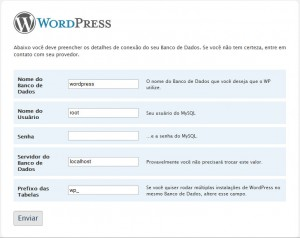
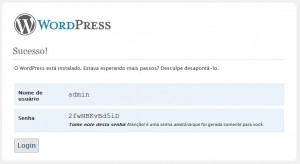

Para **instalar o Wordpess**, devemos primeiramente efetuar o [download do arquivo mais recente](http://br.wordpress.org/releases/#latest "Arquivo mais recente do WordPress já traduzido em Português do Brasil") e descompactá-lo em um servidor com PHP e MySQL, de preferência [LAMP](http://pt.wikipedia.org/wiki/LAMP "Linux, Apache, MySQL e PHP").
Existem 2 maneiras de configurarmos o Banco de Dados:
Se você for um [usuário inexperiente, acesse a partir desta parte](#como-instalar-wordpress-modo-inexperiente).
Se você for um usuários experiente, abra a pasta descompactada do arquivo WordPress e renomeie o arquivo _wp-config-sample.php_ para _wp-config.php_, em seguida altere as seguintes variáveis:

```php
// ** MySQL settings ** //
define('DB_NAME', 'digite_aqui_o_banco_de_dados'); // O nome do Banco de Dados
define('DB_USER', 'digite_aqui_seu_usuario'); // Seu usuário MySQL
define('DB_PASSWORD', 'digite_aqui_sua_senha'); // ...e senha
define('DB_HOST', 'localhost'); // Provavelmente você não precisará trocar este valor
```

Após alterar o arquivo _wp-config.php_, envie-o por FTP para a pasta de diretório host. Enfim, digite no browser sua URL e irá aparecer a seguinte janela \[[vá para o início da instalação](#como-instalar-wordpress-inicio-instalacao "ir para o passo 4")\].

<span id="como-instalar-wordpress-modo-inexperiente">Existe uma maneira mais simples</span>, que é automática. Basta digitar a sua URL no navegador e então clicar no botão **Criar um Arquivo de Configuração**:
[](http://leocaseiro.com.br/wp-content/uploads/2008/10/tutorial-instalacao-wordpress-passo-11.jpg "Como instalar WordPress no Servidor - Criar um arquivo de configuração")

Chegando no Passo 2, ele irá solicitar os seguintes dados:<br>
Nome do Banco de Dados<br>
Usuário do Banco de Dados<br>
Senha do Banco de Dados<br>
Servidor do Banco de Dados<br>
Prefixo das Tabelas(este item, serve apenas para quem possui mais de um blog no mesmo Banco)
[](http://leocaseiro.com.br/wp-content/uploads/2008/10/tutorial-instalacao-wordpress-passo-21.jpg "Como instalar WordPress no Servidor - Dados de acesso")
Se você não tiver algum(ns) destes dados, entre em contato com o seu Servidor de Hospedagem.
Se você tiver, clique em **Vamos começar**

O Passo 3, é muito simples.<br>
Preencha os dados que foram solicitados conforme o meu modelo:
[](http://leocaseiro.com.br/wp-content/uploads/2008/10/tutorial-instalacao-wordpress-passo-31.jpg "Como instalar WordPress no Servidor - Digitando os dados de acesso ao Banco")
Obs: Nem sempre a Senha ficará vazia.<br>
Obs2: Caso tenha dúvidas sobre o último campo, deixe **wp\_**

Agora, clique em Enviar

Caso apareça a mensagem: **Não é possível selecionar o banco de dados**
[](http://leocaseiro.com.br/wp-content/uploads/2008/10/tutorial-instalacao-wordpress-passo-4-erro1.jpg "Como instalar WordPress no Servidor - Erro de seleção do Banco de Dados")
Entre em contato com o seu Sevidor de Hospedagem e solicite a criação do seu banco de dados. Ou verifique se você não digitou pela metade. Alguns servidores criam o banco de dados, conforme o seu usuario, exemplo: leocaseiro\_wordpress

No passo 4, o **WordPress criou o arquivo wp-config.php** corretamente.
[](http://leocaseiro.com.br/wp-content/uploads/2008/10/tutorial-instalacao-wordpress-passo-51.jpg "Como instalar WordPress no Servidor - O arquivo wp-config.php foi criado corretamente")
Portanto clique em **Começar a instalação** e veja como é simples Instalar o WordPress<br>
<span id="como-instalar-wordpress-inicio-instalacao">Agora sim, você pode criar o seu Blog. Fique tranquilo, se você quiser, pode modificar estes dados pelo publicador do WP.</span>
[](http://leocaseiro.com.br/wp-content/uploads/2008/10/tutorial-instalacao-wordpress-passo-71.jpg "Como instalar WordPress no Servidor - Digite o nome do Seu Blog e seu email")
Basta digitar o nome do seu blog, o meu é LeoCaseiro
Em seguida, preencha com o seu email(é importante digitar corretamente, pois todos os comentários, e até mesmo uma senha nova será enviado para ele)

Caso você, assim como eu, queira que o seu site seja encontrado pelo Google, Yahoo e outros buscadores deixe marcado esta opção.<br>
Agora, se você quiser que o seu site não seja encontrado, desmarque-a.<br>
Clique em **Instalar WordPress** e você será redirecionado para
[](http://leocaseiro.com.br/wp-content/uploads/2008/10/tutorial-instalacao-wordpress-passo-81.jpg "Como instalar WordPress no Servidor - Anote sua senha e altere-a o mais breve possível")
Anote a sua senha, depois clique em Login. E pode começar a postar.

Agora, digite o endereço URL do seu BLOG e veja como ficou
[](http://leocaseiro.com.br/wp-content/uploads/2008/10/modelo-blog-wordpress1.jpg "Como instalar WordPress no Servidor - Modelo de um Blog criado")

Obs:Altere a sua senha o mais breve possível. Assim, você não corre o risco de perdê-la.<br>
Para alterar a senha, leia [Como alterar a senha no wordpress](http://leocaseiro.com.br/tutorial-alterar-senha-wordpress "Como alterar a senha no wordpress").
