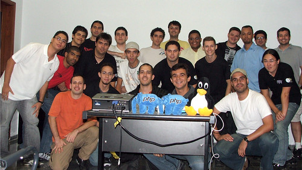

Este post é para os leitores assíduos deste blog(como se fossem muitos rsrs). Mas serve para quem gostaria de uma opinião sobre Framework PHP.

Gostaria de agradecer a todos que participam das discussões deste humilde Blog. Principalmente ao [Felipe Ribeiro](http://feliperibeiro.com/) e ao [Rodrigo Cacilhas](http://montegasppa.blogspot.com/) pelos excelentes comentários e argumentações no [A Linguagem influencia mais que o desenvolvedor](http://leocaseiro.com.br/linguagem-influencia-mais-q-desenvolvedor)? Que é de longe o post mais visitado do Blog.

Peço desculpas para todos os leitores de feed e a todos que esperam por novo conteúdo.

Neste ano de 2009, venho [estudando muita programação](http://leocaseiro.com.br/programador-web-estuda-mais-q-medico) e derivados, além de estar participando de vários projetos contínuos na [MediaDev](http://www.mediadev.com.br/). Estudei diversos CMS para Ecommerces: O [OsCommerce](http://www.oscommerce.com/) que virou [Zen Cart](http://www.zencart.com/), o [PrestaShop](http://www.prestashop.com/) e o excepcional [Magento](http://www.magentocommerce.com/).

E com a dificuldade de otimização na maioria deles, juntando com a incompatibilidade do Servidor para a utilização do Magento. [Well Rocha](http://wellrocha.com.br/) e eu concluímos que o melhor era utilizar um FrameWork.
Após [estudarmos muito sobre o assunto](http://leocaseiro.com.br/programador-web-estuda-mais-q-medico) e depois de ficarmos maravilhados com a modularidade do Magento, decidimos que ao invés de utilizarmos o [CodeIgniter](http://codeigniter.com/) ou o [CakePHP](http://cakephp.org/), o [Zend Framework](http://zendframework.com/) era o mais apropriado. Eu até [comentei no post anterior](http://http://leocaseiro.com.br/linguagem-influencia-mais-q-desenvolvedor) que estava pensando em estudá-lo.

Por ser da [Zend](http://www.zend.com/) que desenvolve o [PHP](http://www.php.net/) e ser feito todo em PHP5, com uma comunidade que está crescendo no Mundo e no Brasil. É modular, são feitos testes unitários antes de atualizarem uma nova versão, é altamente expansível e milhares de outros motivos. Além do @hilios do [Hello Web](http://www.helloweb.blog.br/) que nos ensinou muita coisa e nos motivou a utilizá-lo, apostamos todas as fichas nele. E como esperado, estamos concluindo nosso primeiro sistema em ZF.
Em breve, desejo postar um passo a passo para quem está iniciando no ZF. Enquanto isso, siga-me no Twitter que eu comento diversos componentes dele. [@leocaseiro](http://twitter.com/leocaseiro)

Além de estar envolvido neste Ecommerce e [outros projetos por fora](http://leocaseiro.com.br/nao-cobre-como-sobrinhos-p-construir-sites)(em Wordpress e PHP com OOP), concluí o [Curso SEO](http://www.marketingdebusca.com.br/curso-seo/) do [Marketing de Busca](http://www.marketingdebusca.com.br/) no início de Janeiro deste ano de 2009 e aprendi muito sobre o assunto. O Paulo é didático e paciente. Perguntei tudo o que podia sobre o assunto e pretendo montar uns artigos em breve.

Estive presente também no 1o Encontro do [PHP-SP](http://phpsp.org.br/). Presenciei uma palestra com 4 ZCEs([Augusto Pascutti](http://www.augustopascutti.com/), [Duodraco](http://duodraco.wordpress.com/), [Ivan Rosolen](http://ivanrosolen.com/) e [Rafael Dohms](http://www.rafaeldohms.com.br/)) focada na prova de Certificação da Zend voltada ao PHP e uma aula com o [Edgar da Silva](http://www.manjaphp.com.br/) sobre o Zend FrameWork.

Olha uma foto ae(sou o de laranja, pra quem não sabe...rsrs)

Bom, como podem perceber estou [estudando bastante](http://leocaseiro.com.br/programador-web-estuda-mais-q-medico) e trabalhando muito. Os 2 em paralelo e com isso é complicado montar artigos de qualidade.
Se quiser, me acompanhe no twitter que eu estou sempre por lá. Geralmente posto métodos e funções do ZF ou assuntos gerais da área. Raramente posto coisas inúteis, como muitos twitters rsrs...

> Siga-me: [@leocaseiro](http://twitter.com/leocaseiro)
